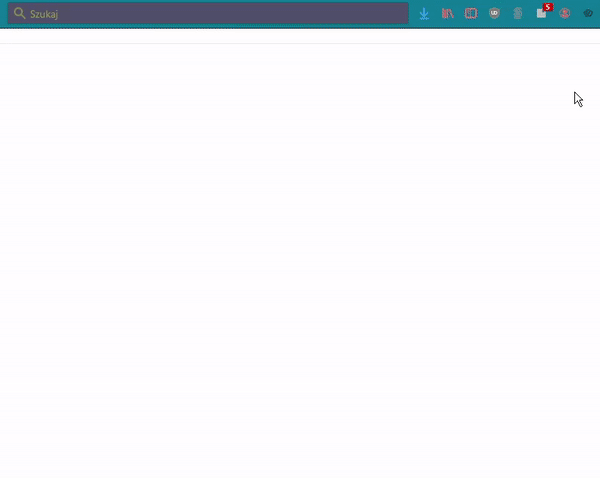

# Table of contents

### 1. [Usage](#usage)
1. [Options](#options)
2. [Settings](#settings)
### 2. [Deck building](#deck-building)
1. [Converting images into deck](#converting-images-into-deck)
2. [Importing deck](#importing-deck)
3. [Ready-to-use decks](#ready-to-use-decks)
### 3. [Development](#development)
1. [Building](#building)
2. [Testing in Mozilla Firefox](#testing-in-mozilla-firefox)

# Usage
Feeshky is a browser addon imitating flashcards.



## Options

Addon allows to change color theme, side of cards and most importantly flashcard deck.

There is only one deck by default (with english idioms) but there is possibility to add other ones.

## Settings

To open feeshky's settings one needs to click gear icon on addon popup.
There are 2 sections, first one allows to choose available in popup decks from imported ones while the second section is in charge of importing decks.

# Deck building

Deck is a set of flashcards described using JSON.

Example deck - JSON
```JSON
{
    "name": "ExampleDeck",
    "cards": [
        [
            {
                "text": "Is it possible to learn this power?",
            },
            {
                "text": "Not from a Jedi."
            }
        ],
    ]
}
```
Basically deck is defined by name and cards. Cards are array of flashcards. Flashcard is an array of two (!) sides.

First declared side is prompt (question) side by default, but there is option allowing to reverse sides. 

Side of card includes 3 properties:
- `text` - string containing text of prompt or answer
- `image` - image converted to BASE64 string
- `audio` - audio file converted to BASE64 string

Card shows only `text` or `image` while `image` has higher priority.
`audio` may be omitted.

## Converting images into deck

To convert folder of images into deck (promt = name of image file, answer = image converted to BASE64) one may use `imagesToDeck.py` script.

>python imagesToDeck.py /path/to/folder/of/images nameOfDeck --reverse

The `--reverse` flag swaps prompt and answer order. It is optional.

## Importing deck

To import deck, first one needs to download the deck in `json` format from `/decks` folder by opening file raw and saving as file (RAW -> RMB -> save page as). Then one should open settings page of addon (by simpy clicking gear icon on addon popup) and use `browse` and `import` buttons.

## Ready-to-use decks

* English idioms
* Countries flag, also seperated by continent
* Music notes, also in only-treble and only-bass key
* Music major scale keys
* Chess notation (e.g. E2, D4, H7)
* Pokemons, obviously ʕ•ᴥ•ʔ

# Development

## Building
To build app one needs to step into <i>react-app</i> directory and follow with <i>npm install</i> and <i>npm run build</i> commands.

> cd react-app

> npm install

> npm run build

After building process all neccessary files will be moved into <i>popup</i> folder.
## Testing in Mozilla Firefox
To add custom addon one should go to [debug page](about:debugging#/runtime/this-firefox).
